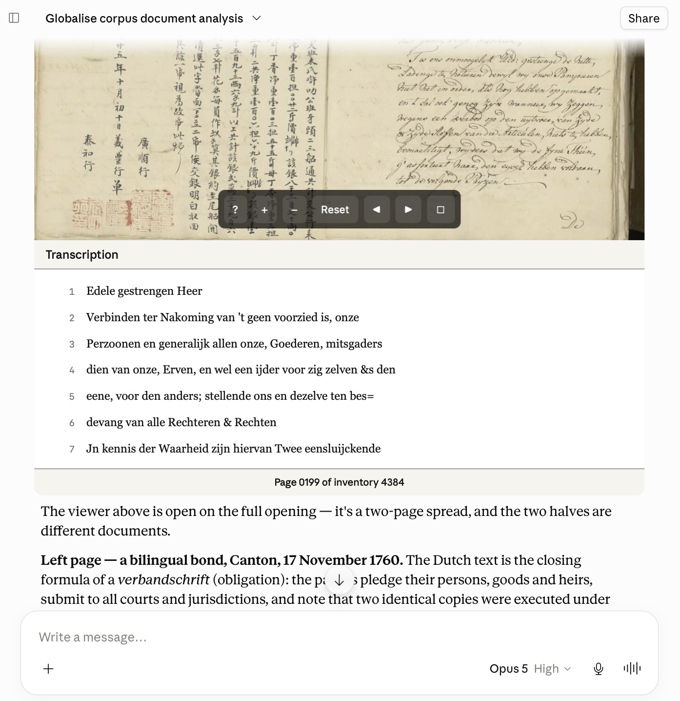

# Globalise MCP

A Model Context Protocol (MCP) server and [API documentation](./globalise-transcriptions-api/) for accessing transcriptions of 17–18th century Dutch East India Company (VOC) records hosted by the [GLOBALISE project](https://globalise.huygens.knaw.nl). Beyond offering natural language search and retrieval of the corpus, the Globalise MCP draws on archival finding aids and glossaries of VOC commodities and historical weights and measures to allow an AI-assistant to offer richer, more contextualised answers to queries. Users can view and interact with page scans and transcriptions from the corpus and direct the AI-assistant to navigate and analyse them.

> This tool was developed as a technology demo by the [Research and Infrastructure Support](https://rise.unibas.ch/en/) (RISE) group at the University of Basel. We are particularly interested in exploring the research opportunities, methodological risks, and technical challenges posed by retrieving and analysing data with LLMs. If you are interested in collaborating with us in this area, please [get in touch](mailto:rise@unibas.ch).

### About GLOBALISE

The [GLOBALISE project](https://globalise.huygens.knaw.nl/) is digitizing and [making accessible](https://transcriptions.globalise.huygens.knaw.nl/) the archives of the Dutch East India Company (VOC). The corpus focuses on the [_Overgekomen Brieven en Papieren_](https://www.nationaalarchief.nl/onderzoeken/archief/1.04.02) which were sent from the VOC's Asian headquarters in Batavia to the Dutch Republic in the seventeenth and eighteenth centuries and are now held by the [Dutch National Archives](https://www.nationaalarchief.nl). The transcriptions were machine-generated using an open-source [Handwritten Text Recognition (HTR) toolkit](https://github.com/knaw-huc/loghi) and are freely available under a Creative Commons [CC0 license](https://creativecommons.org/publicdomain/zero/1.0) together with their metadata and page scans.

### Features

- Search the full text of c. 4.78 million machine-transcribed pages from the *OBP* for a word or phrase, narrow the results by inventory number or language, and combine terms with boolean operators, wildcards, and fuzzy matching to catch historical spellings.
- Retrieve any page by its identifier to read the complete transcription line by line, together with its languages, dates, rights statement, and links to the original scan at the Dutch National Archives.
- Move page by page through an inventory to follow a volume in sequence instead of jumping between scattered search results.
- View a page scan beside its line-numbered transcription in an interactive viewer, and ask the AI assistant to zoom in on a detail or examine the image for you.
- Search more than 228,000 *TANAP* finding-aid entries — the catalogue layer above the transcriptions — to locate the right inventories before reading any pages, and to reach the published scholarly edition of the *Generale Missiven* in the RGP series at the Huygens Institute.
- Look up a VOC trade good or a historical unit of weight, volume, length, or area to find the period term to search for, its spelling variants, a sourced definition, and any recorded conversion ratios.
- Run searches and lookups from the command line with the [bundled CLI client](./globalise-mcp-server/README.md), which outputs JSON for piping into tools like `jq`.

<p align="center"></p>

### Installation

The best way to get started is with [Claude Desktop](https://claude.com/download) or [claude.ai](https://claude.ai) by adding the Globalise MCP as a *hosted service* or [custom 'Connector'](https://support.claude.com/en/articles/11175166-get-started-with-custom-connectors-using-remote-mcp) with the URL below. This is currently free for one connector — additional connectors in Claude require a paid ('Pro') or higher [subscription](https://claude.com/pricing) from Anthropic.

```
https://globalise-mcp-production.up.railway.app/mcp
```
Go to _Customize_ → _Connectors_ → _Add custom connector_ → Name it as you like and paste the URL into the _Remote MCP Server URL_ field. You can ignore the Authentication section. Once the connector is configured, optionally set the permissions for its tools (e.g. 'Always allow'). See Anthropic's [documentation](https://support.claude.com/en/articles/11175166-get-started-with-custom-connectors-using-remote-mcp) for more detailed instructions. Many other desktop and web-based clients such as OpenAI's ChatGPT or Mistral's LeChat and open-source applications support custom MCP servers. Please consult their documentation for more information.

Alternatively, you can install the Globalise MCP server *locally* on your own computer. The simplest way to do this is with a Claude Desktop [extension](https://support.claude.com/en/articles/10949351-getting-started-with-local-mcp-servers-on-claude-desktop). Download [this project's ~5MB `.mcpb` extension](https://github.com/kintopp/globalise-mcp/releases/latest) and then double-click it to install it with Claude Desktop. This will download a small ~110MB database with the project's finding aids and historical glossaries. To install the Globalise MCP server manually, please consult the [technical notes](./globalise-mcp-server/README.md).

### SKILL file

A `skill` gives an AI assistant detailed guidance on how to use a resource such as an MCP server effectively: which tool to choose for a given question type, how to combine searches, important metadata distinctions, and known limitations. Skills were [originally developed by Anthropic](https://support.claude.com/en/articles/12512176-what-are-skills) for their Claude products but have since become a widely-supported [open standard](https://agentskills.io/home). Making use of the Globalise MCP skill file is optional but will usually improve the quality and efficiency of the AI assistant’s responses.

Download: [`globalise-voc-research.skill`](https://github.com/kintopp/globalise-mcp/releases/latest). The downloaded skill file can be installed in Claude by following [these instructions](https://claude.com/resources/tutorials/teach-claude-your-way-of-working-using-skills). Else, please consult the documentation of your MCP client to learn how to install or make use of it there.

#### MCP Server Tools

Most of the tools listed below were designed to reproduce functionality provided by the [GLOBALISE Transcriptions Viewer](https://transcriptions.globalise.huygens.knaw.nl/). A few tools, such as `globalise_inspect_page_image`, `globalise_navigate_viewer`, `globalise_lookup_commodity` and `globalise_lookup_measure` offer additional features not available there.

- **`globalise_search_transcriptions`** — Searches the full text of approximately 4.78 million indexed transcription pages for a word or phrase, much like a regular keyword search, and returns the best-matching passages with the search terms highlighted. It can narrow by inventory number or language and combine terms with `AND`/`OR`/`NOT`, quoted phrases, wildcards, and fuzzy matching. This also helps address historical variants.

- **`globalise_retrieve_document`** — Fetches a single page using its identifier and returns the complete transcription line by line together with its metadata: languages, dates, and rights statement. It also reports the identifiers of the preceding and following pages and provides links to the GLOBALISE transcription viewer and the original scan held by the Dutch National Archives.

- **`globalise_navigate`** — Moves one page forward or backward from a given page, so you can read through a volume in sequence instead of jumping between scattered search results. It returns the neighbouring page in full — transcription, metadata, and links — and tells you when you have reached the beginning or end of the run.

- **`globalise_find_archival_documents`** — Searches a local TANAP index of finding-aid entries (the catalogue level that sits above the page transcriptions) so the right inventories can be located before reading any pages. It covers two bodies of material: the OBP digitised indexes and the Generale Missiven, many of which link to their scholarly published edition (the RGP series) at the Huygens Institute.

- **`globalise_lookup_commodity`** — Looks up a trade good in a local glossary of VOC commodities, returning the historical term used, an English label, and a provenance and confidence-labelled definition. It serves as the bridge between a modern vocabulary and the words to search for in the historical transcriptions; some entries also list period spelling variants. Every result can return a link to the concept's page in the GLOBALISE SKOSMOS thesaurus.

- **`globalise_lookup_measure`** — Looks up a VOC unit of weight, volume, length, or area in a historical glossary and returns its category, its period spelling variants, and the conversion ratios recorded for it. It is not a conversion calculator. Early-modern measures were unstable, and every ratio shown here comes from a specific place and commodity, which is explained in a context note.

- **`globalise_view_document_ui`** — Opens a page in an interactive viewer that displays the zoomable, high-resolution scan of the original manuscript beside its line-numbered transcription. 

- **`globalise_inspect_page_image`** — Fetches a page scan, or a region of it, as an image for the AI assistant itself to look at. The assistant can also zoom into a page by itself when you ask about a specific detail.

- **`globalise_navigate_viewer`** — Lets the AI assistant steer an open viewer: for example to zoom it to a region to direct your attention to a detail. When you ask the assistant about a passage it inspects, the viewer auto-zooms to match. An internal tool, `globalise_poll_viewer_commands`, is the viewer's own channel for passing the navigation commands to the open page.

### Historical Finding Aids and Glossaries

#### Finding aids

A local SQLite database of more than 228,000 finding-aid entries derived from the TANAP descriptions of the VOC archive (the catalogue layer that sits above the page-level transcriptions). The bulk of it (some 227,000 entries) comes from the digitised indexes to the *Overgekomen brieven en papieren* (OBP), the papers sent home from Asia, each entry recording the VOC settlement it concerns, the year, and the inventory number and folio where the papers sit. Alongside these are roughly 950 entries for the *Generale Missiven*, the governors-general's periodic dispatches from Batavia to the Dutch Republic, many linked to their published scholarly edition in the RGP series at the Huygens Institute. It is the dataset behind the `globalise_find_archival_documents` tool.

**Editorial process:**

The original finding aids are re-used effectively unchanged: no entry has been added, removed, or reworded, and every description remains exactly as published. The *Generale Missiven* file is identical to the CSV distributed on the Dataverse (see below); the *OBP* indexes are distributed as a spreadsheet (version 2, 2025) and were exported with all sixteen columns and all 227,526 rows intact. What has changed is their structure. The build script only loads the subset of columns the search tool actually uses — thirteen of the sixteen *OBP* columns and eighteen of the twenty-four *Generale Missiven* columns — setting aside internal bookkeeping such as the typoscript folio strings, the scan filenames, and a manual-check notes column. It then converts folio, scan, and year figures from text into numbers so they can be filtered and sorted, treating blanks as "unknown" rather than as zero. The Dutch `HTR van IJsberg beschikbaar?` column is read as a true/false flag. Finally, it creates a full-text index over the descriptions and a set of ordinary indexes over inventory number, settlement, and year. The two collections are kept as separate tables and searched as one, so a single query reaches both the papers and the dispatches. The two sources carry different licences — the *OBP* indexes are CC-BY-4.0 and the *Generale Missiven* overview is CC-BY-SA-4.0 — so the combined database is redistributed under the more restrictive of the two, CC-BY-SA-4.0.

Local:
- Generale Missiven ([generale-missiven.csv](./globalise-mcp-server/data/sources/generale-missiven.csv))
- OBP ([obp-indexes.csv](./globalise-mcp-server/data/sources/obp-indexes.csv))

Sources:
- [GLOBALISE — Digitized Indexes of the Dutch East India Company OBP (1602–1799)](https://hdl.handle.net/10622/LVOQTG) — IISG Dataverse
- [Overzicht van Generale Missiven in het archief van de VOC, 1.04.02](https://hdl.handle.net/10622/BHKMWE) — IISG Dataverse
- [VOC archive finding aid 1.04.02](https://www.nationaalarchief.nl/onderzoeken/archief/1.04.02) — Dutch National Archives
- [Generale Missiven RGP edition online](https://resources.huygens.knaw.nl/retroboeken/generalemissiven/) — Huygens Institute

#### Historical glossaries

Two local reference vocabularies, in a small SQLite database, help translate between modern vocabulary and the historical and regional terms found in the corpus. The commodities glossary covers about 3,500 trade goods, giving for each the period Dutch term, an English label, spelling variants, and a sourced, confidence-rated definition, with links to the official GLOBALISE commodities thesaurus. N.B. The commodities glossary was derived from the October 2023 (v1) release of the GLOBALISE commodities thesaurus and was subsequently extensively revised and enriched, including with the help of AI models (more than half of the definitions are AI-generated and labelled as such). For this reason, it is NOT an official dataset of the GLOBALISE project. The weights-and-measures glossary describes some 213 historical units of weight, volume, length, and area drawn from an eighteenth-century reference work (1764–1771), recording each unit's spelling variants and the place- and commodity-specific conversion ratios attested for it. This document was only lightly revised, but is also NOT an official dataset of the GLOBALISE project. Both glossaries retain their original CC-BY-SA-4.0 license.

**Editorial process:**

The GLOBALISE *commodities thesaurus* was extensively revised because the published v1 release is unfinished: of its 3,787 concepts, 2,294 were marked "NOT YET CLASSIFIED", carrying neither a definition nor an English label, and the datasheet invited users to help fill the gap. Sixty-six umbrella categories (*Food and live animals* and the like) were set aside as hierarchy rather than trade goods; forty-five entries were dropped as non-commodities, empty placeholders, unverifiable terms, or true duplicates; and five homonyms were disambiguated with qualifiers (*Aarde (bodem)* versus *Aarde (pigment)*). 

The remaining ~3,500 concepts were then given a definition apiece — coverage rose from roughly 39% to 100%, and English labels from roughly 39% to 99.5% — drawn from a deliberate order of preference: the GLOBALISE project's own definitions first (543), then the *Woordenboek der Nederlandsche Taal* (517), the Getty Art & Architecture Thesaurus (380), and the Huygens *VOC-Glossarium* (108), with the remaining ~1,900 written by an AI model prompted with evidence from the corpus itself (some 354,000 passages retrieved for 1,759 terms). Because that last group is the largest, every entry records where its definition came from and how much to trust it — about 45% *high* confidence, 24% *medium*, and 31% *low* or *medium-low*. Two subsequent rounds of correction were then folded in: 49 Getty definitions had matched a Dutch word to the wrong sense (e.g. *comptoir* as a home office rather than a trading post, *harp* as the instrument rather than a pepper-sieve, *kiel* as a smock rather than a ship's keel) and were rewritten against the corpus, and three *ruinas* entries were reclassified from rhubarb to madder.

The GLOBALISE *Weights and Measures glossary*, by contrast, was only restructured: the Dataverse release is three separate spreadsheets — 213 unit definitions, some 400 spelling labels, and 731 conversions — which were merged into a single lookup structure keyed by unit, with the labels lowercased and de-duplicated into 385 search variants. Its content is untouched, down to keeping twenty-two circular `1 X = 1 X` conversions and a handful of duplicate rows, which are incomplete period attestations rather than mistakes.

Local:
- GLOBALISE Commodities ([commodities.tsv](./globalise-mcp-server/data/sources/commodities.tsv))
- Weights & Measures ([weights-measures.json](./globalise-mcp-server/data/sources/weights-measures.json))

Sources:
- [GLOBALISE Thesaurus — Commodities](https://hdl.handle.net/10622/YAWDOV) — IISG Dataverse
- [GLOBALISE — Weights and Measures in the 18th-Century Indian Ocean World](https://hdl.handle.net/10622/MDNVH5) — IISG Dataverse

### API Documentation

- [Overview](./globalise-transcriptions-api/README.md) - Overview of the API and how it was documented.
- [API Reference](./globalise-transcriptions-api/API_REFERENCE.md) - Endpoints, parameters, and examples
- [Query Syntax](./globalise-transcriptions-api/QUERY_SYNTAX.md) - Boolean operators, wildcards, fuzzy matching
- [Data Models](./globalise-transcriptions-api/DATA_MODELS.md) - Response structures and field definitions
- [OpenAPI Specification](./globalise-transcriptions-api/openapi.yaml) - Machine-readable API spec

### Authors

[Arno Bosse](https://orcid.org/0000-0003-3681-1289) — [RISE](https://rise.unibas.ch/), University of Basel, with [Claude Code](https://claude.com/product/claude-code), Anthropic.

### Citation

If you use the GLOBALISE MCP Server in your research, please cite it and the underlying GLOBALISE transcriptions separately:

#### Globalise VOC Transcriptions

When using the transcriptions, please cite:
> NL-HaNA, VOC, [inv.nr.], [scan nr.], transcription GLOBALISE project (https://globalise.huygens.knaw.nl/), March 2024

#### Globalise MCP Server

**APA (7th ed.)**

> Bosse, A. (2026). *GLOBALISE MCP Server* (Version 0.9.0) [Software]. Research and Infrastructure Support (RISE), University of Basel. https://github.com/kintopp/globalise-mcp

**BibTeX**
```bibtex
@software{bosse_2026_globalise_mcp,
  author    = {Bosse, Arno},
  title     = {{GLOBALISE MCP Server}},
  year      = {2026},
  version   = {0.9.0},
  publisher = {Research and Infrastructure Support (RISE), University of Basel},
  url       = {https://github.com/kintopp/globalise-mcp},
  orcid     = {0000-0003-3681-1289},
  note      = {Developed with Claude Code (Anthropic, \url{https://www.anthropic.com})}
}
```
A machine-readable [`CITATION.cff`](./CITATION.cff) for the GLOBALISE MCP server is included in the root of this repository.

## License

This project is licensed under the MIT License — see the [LICENSE](LICENSE) file for details. **The MIT License covers the source code only**; the bundled and derived datasets carry their own terms.

- GLOBALISE transcriptions, document metadata, and National Archives page images: [CC0 1.0](https://creativecommons.org/publicdomain/zero/1.0/) (Creative Commons Zero).
- Archival finding-aid index (`archival-index.sqlite`), derived from [GLOBALISE — Digitized Indexes of the Dutch East India Company OBP (1602–1799)](https://hdl.handle.net/10622/LVOQTG) ([CC BY 4.0](https://creativecommons.org/licenses/by/4.0/)) and [Overzicht van Generale Missiven in het archief van de VOC, 1.04.02](https://hdl.handle.net/10622/BHKMWE) ([CC BY-SA 4.0](https://creativecommons.org/licenses/by-sa/4.0/deed.en)).
- Commodities and weights-&-measures glossaries (`reference.sqlite`), derived from the [GLOBALISE Thesaurus — Commodities](https://hdl.handle.net/10622/YAWDOV) and [GLOBALISE — Weights and Measures in the 18th-Century Indian Ocean World](https://hdl.handle.net/10622/MDNVH5), both [CC BY-SA 4.0](https://creativecommons.org/licenses/by-sa/4.0/deed.en).

The derived databases and the modified source files under [`data/sources/`](./globalise-mcp-server/data/sources/) are redistributed under [CC BY-SA 4.0](https://creativecommons.org/licenses/by-sa/4.0/deed.en). The glossaries have been substantially revised and are not official GLOBALISE datasets; see [Historical Finding Aids and Glossaries](#historical-finding-aids-and-glossaries) for attribution and a description of the changes made.
