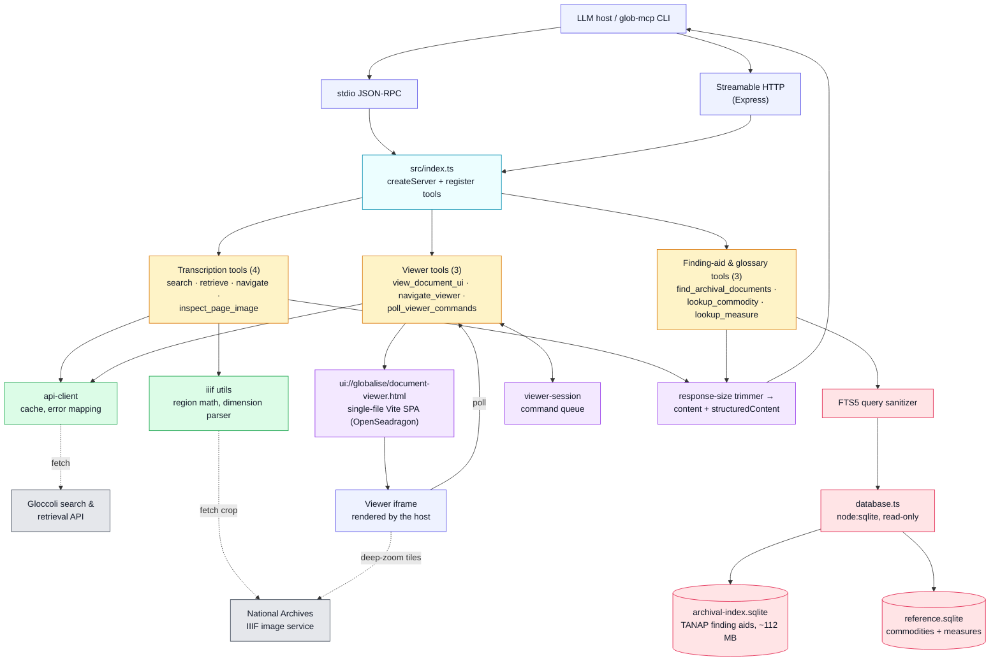

# GLOBALISE MCP Server

## Overview

A TypeScript MCP server, built on the official [MCP SDK](https://github.com/modelcontextprotocol/typescript-sdk), that exposes ten tools over two transports: **stdio** for local hosts (Claude Desktop, ChatGPT Desktop) and **Streamable HTTP** (Express) for web hosts and the hosted Railway instance. The tools fall into two groups. The transcription tools (`search`, `retrieve`, `navigate`, `inspect_page_image`) proxy the upstream GLOBALISE services — the Gloccoli search API, TextRepo text storage, AnnoRepo annotations, and the Dutch National Archives IIIF image service — behind a unified client with caching, a byte-budget response trimmer, and structured error mapping. The archival finding-aid and glossary tools run entirely offline against bundled SQLite databases (an FTS5-indexed TANAP archival index plus the commodities and weights-&-measures reference glossaries), read via Node's built-in `node:sqlite` — the dependency tree is pure JavaScript, with no native binaries.

The server also registers an interactive document viewer: a single-file Vite SPA (OpenSeadragon deep-zoom scan beside the line-numbered transcription) served as an MCP Apps resource and rendered inline by supporting hosts, with a pair of session tools providing a two-way channel between the model and the open viewer. Finally, `scripts/cli.mjs` (`glob-mcp`) is a headless CLI **client** that drives the same server tools an LLM does — useful as a `jq`-friendly pipe or a debug harness.

## Architecture



## Requirements

- **Node 24.x** — the server uses the built-in `node:sqlite` module (available without flags since Node 24.0). The `engines` field pins `>=24.15.0 <25` to match the runtime bundled with Claude Desktop.
- **~115 MB of disk** for the local databases: the committed `data/*.sqlite.gz` archives are decompressed on first build.
- **Network access** to the upstream GLOBALISE services for the transcription tools (locally-run servers may receive upstream `403` responses — see the transports table under [CLI](#cli)); the finding-aid and glossary tools work fully offline.
- **No native binaries** — all dependencies are pure JavaScript, so there is no compilation step and the same install works across platforms.

## Quick Start

**Local** 

stdio:
```bash
npm install && npm run build && node dist/index.js
```

HTTP:
```bash
TRANSPORT=http PORT=3000 node dist/index.js
```

## Claude Desktop

Add to `~/Library/Application Support/Claude/claude_desktop_config.json`:

```json
{
  "mcpServers": {
    "globalise": {
      "command": "node",
      "args": ["/absolute/path/to/globalise-mcp-server/dist/index.js"]
    }
  }
}
```
**Hosted instance** (no setup required):
```
https://globalise-mcp-production.up.railway.app/mcp
```
## CLI

`scripts/cli.mjs` (`glob-mcp`) is a headless MCP **client** over this server's stateless tools. A CLI
query and an LLM query call the *same* `callTool()` on the *same* server, so results are identical — it
doubles as a `jq`-friendly pipe, an offline debug harness, and an agent bootstrap. JSON-first output:
list tools → JSONL, single-object tools → one compact JSON; counts/notes go to stderr. Four tools
(`globalise_view_document_ui`, `globalise_inspect_page_image`, `globalise_navigate_viewer`,
`globalise_poll_viewer_commands`) are excluded — the viewer and the two session tools need the MCP-App
iframe, and the image tool returns base64 bytes for the model, none of which is meaningful headless.
Exit codes: `0` ok · `1` tool/connection error · `2` usage error.

### Install (CLI-only)

Node 24.x is the only prerequisite — no extra tooling. From `globalise-mcp-server/`:

```bash
npm run setup   # stdio (default): install deps + build (decompresses the local DBs) — run once
npm run deps    # http-only: install just the npm deps (the MCP SDK); skips the build + DBs
```

Both are thin aliases (`setup` = `npm install && npm run build`; `deps` = `npm install`) that exist to
name the two starting points: the hosted-server route needs neither the build nor the 115 MB of DBs.

### Transports & requirements

The CLI defaults to **stdio** (spawns `node dist/index.js` locally). Pass `--http <url>` (or set
`GLOBALISE_MCP_HTTP`) to drive a running server instead — e.g. the hosted Railway instance, no local
build required.

| | **stdio** (default) | **http** (`--http <url>`) |
|---|---|---|
| Setup | `npm run setup` | `npm run deps` |
| Node.js | 24.x | 24.x |
| Local build (`dist/`) | required | — |
| Local DBs (~115 MB) | required (build decompresses them) | — |
| Network | only `search` / `retrieve` / `navigate`; these may receive upstream 403, while `find` / `commodity` / `measure` run offline | always (to the remote server) |
| Best for | local development and offline finding-aid + glossary lookups | quickest start and hosted transcription access, no 115 MB build |

### Usage

Everything after `npm run cli --` is forwarded verbatim to the CLI (the `--` is what stops npm from
eating the flags); `node scripts/cli.mjs …` is the equivalent direct invocation.

```bash
# stdio (after `npm run setup`): glob-mcp spawns node dist/index.js
npm run cli -- search "peper" --inventoryNumber 9966 --max 5 --fields id,document
npm run cli -- retrieve NL-HaNA_1.04.02_9966_0106 --json
npm run cli -- find "Amsterdam" --source gm --chamber Amsterdam --max 5 --table
npm run cli -- commodity "mace" --fields prefLabelNl,prefLabelEn
npm run cli -- navigate NL-HaNA_1.04.02_9966_0106 --direction next --fields targetDocument

# http (after `npm run deps`): point at a running server — instant, no local build
npm run cli -- --http https://globalise-mcp-production.up.railway.app/mcp search "nootmuskaat" --max 3
npm run cli -- --http https://globalise-mcp-production.up.railway.app/mcp retrieve NL-HaNA_1.04.02_9966_0106 --json
GLOBALISE_MCP_HTTP=https://globalise-mcp-production.up.railway.app/mcp npm run cli -- find "Batavia"

# discovery / dry-run / batch
npm run cli -- --help                       # offline-safe usage + command list
npm run cli -- search --help                # schema-derived flags + a worked example
npm run cli -- tools --compact              # compact capability manifest (agent bootstrap)
npm run cli -- --show-call search "peper"   # resolve {tool, arguments} without calling
printf 'peper\nfoelie\n' | npm run --silent cli -- commodity --stdin --max 2 --fields prefLabelNl
```

**Piping:** `npm run` prints a `> globalise-mcp-server@x.y.z cli` banner to **stdout**, which would
corrupt the JSONL stream. When piping into `jq` or a file, either pass `--silent` *before* the script
name (`npm run --silent cli -- …`, as above) or call `node scripts/cli.mjs …` directly — both leave
stdout pure, with counts and notes on stderr. `npm run test:cli` smoke-tests the CLI — out of the
default `npm test` chain, since it needs `dist/` + DBs + network.

## Environment Variables

| Variable | Default | Purpose |
|----------|---------|---------|
| `TRANSPORT` | `stdio` | `http` for Streamable HTTP mode |
| `PORT` | `3000` | HTTP port |
| `MCP_ALLOWED_ORIGINS` | claude.ai/claude.com/chatgpt.com | **Enforced** Origin guard: rejects non-allowlisted browser origins with HTTP 403 (spec MUST, DNS-rebinding mitigation). Exact origins or `*.domain` globs; `*` disables. |
| `ALLOWED_ORIGINS` | `*` | **Advisory** CORS allowlist — sets `Access-Control-Allow-Origin` response headers only; rejects nothing. Comma-separated; `*` allows all. This is a *separate* var from `MCP_ALLOWED_ORIGINS`: tightening the 403 guard does **not** tighten CORS headers, and vice versa. |
| `STRUCTURED_CONTENT` | `true` | Set `false` to strip `outputSchema`/`structuredContent` for clients that reject them (MSTY, Jan.ai) |

## Development

```bash
npm run build       # Viewer UI + TypeScript + archival index DB
npm run dev         # tsc watch mode
npm run inspector   # Build + run against MCP Inspector
npm test            # Full offline suite (version-sync, FTS, SQLite tools, viewer, smoke, HTTP shutdown)
npm run test:live   # Opt-in: live integration tests; fails with 403 when local upstream access is denied
```

## License

This project is licensed under the MIT License — see the [LICENSE](LICENSE) file for details. **The MIT License covers the source code only**; the bundled and derived datasets carry their own terms.

- GLOBALISE transcriptions, document metadata, and National Archives page images: [CC0 1.0](https://creativecommons.org/publicdomain/zero/1.0/) (Creative Commons Zero).
- Archival finding-aid index (`data/archival-index.sqlite`), derived from [GLOBALISE — Digitized Indexes of the Dutch East India Company OBP (1602–1799)](https://hdl.handle.net/10622/LVOQTG) ([CC BY 4.0](https://creativecommons.org/licenses/by/4.0/)) and [Overzicht van Generale Missiven in het archief van de VOC, 1.04.02](https://hdl.handle.net/10622/BHKMWE) ([CC BY-SA 4.0](https://creativecommons.org/licenses/by-sa/4.0/deed.en)).
- Commodities and weights-&-measures glossaries (`data/reference.sqlite`), derived from the [GLOBALISE Thesaurus — Commodities](https://hdl.handle.net/10622/YAWDOV) and [GLOBALISE — Weights and Measures in the 18th-Century Indian Ocean World](https://hdl.handle.net/10622/MDNVH5), both [CC BY-SA 4.0](https://creativecommons.org/licenses/by-sa/4.0/deed.en).

The derived databases and the modified source files under [`data/sources/`](./data/sources/) are redistributed under [CC BY-SA 4.0](https://creativecommons.org/licenses/by-sa/4.0/deed.en). The glossaries have been substantially revised and are not official GLOBALISE datasets; the [repository README](../README.md#historical-finding-aids-and-glossaries) documents the attribution and the changes made.